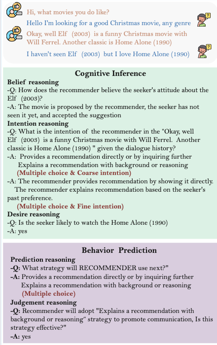

# RecToM: A Benchmark for Evaluating Machine Theory of Mind in Recommendation Dialogues

This repository contains the official dataset, evaluation scripts, and benchmark details for our AAAI-accepted paper:

> **RecToM: A Benchmark for Evaluating Machine Theory of Mind in Recommendation Dialogues**

---

## 🌟 Overview

**RecToM** is a benchmark designed to rigorously evaluate the **Theory of Mind (ToM)** capabilities of Large Language Models (LLMs) within **recommendation dialogues**.  
LLMs must infer users’ **Beliefs**, **Desires**, and **Intents** during multi-turn interactions—skills essential for building context-aware and effective recommender systems.

<p align="center">
  
</p>

### 🔍 Key Features

#### 🧭 Multi-choice Strategy  
A single utterance may express **multiple distinct intentions**. RecToM captures this natural conversational complexity.

#### 🔎 Multi-granular Intentions  
Intentions are **hierarchical**: an utterance may contain both a high-level purpose and fine-grained contextual sub-intentions.

#### 📚 Multi-dimensional Beliefs  
Beliefs about items (e.g., movies) involve multiple interconnected aspects:  
who introduces the item, whether the seeker has watched it, and their levels of preference or acceptance.

#### 🎯 Multi-concurrent Desires  
Users frequently pursue **multiple goals simultaneously**, such as exploring new items while comparing alternatives.

---

## 📊 Dataset Structure & Statistics

RecToM contains **20,524** expertly annotated dialogue–query pairs across **10 ToM reasoning categories**.

### ✨ Question Type Statistics

| Question Type | Quantity | # Options | Answer Type |
|---------------|----------|-----------|-------------|
| Desire (Seek) | 1,448 | 2 | single |
| Coarse Intention (Rec / Seek) | 2,205 / 2,205 | 5 / 4 | multiple |
| Fine Intention (Rec / Seek) | 2,205 / 2,205 | 10 / 16 | multiple |
| Belief (Rec) | 1,762 | 7 | single |
| Prediction (Rec / Seek) | 2,098 / 2,149 | 5 / 4 | multiple |
| Judgement (Rec / Seek) | 2,098 / 2,149 | 2 / 2 | single |

*Table: Statistics of question types and option distributions in RecToM.*


## 🔧 Evaluation

(You can fill in your evaluation script usage, for example:)

```bash
bash 12_run.sh

